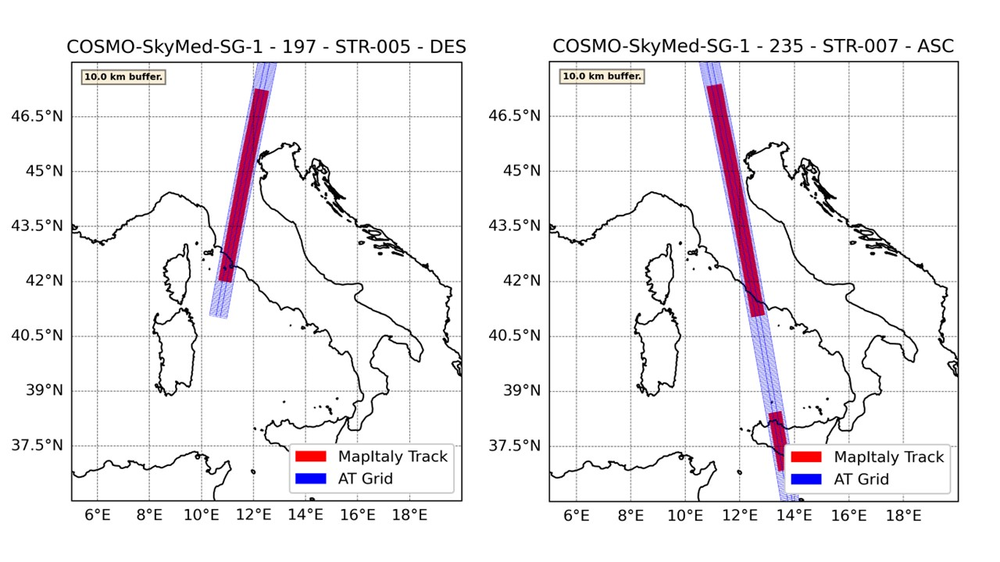

Map Italy - Along Track Grid
---
[![Language][]][1]
[![License][]][1]

---
### Generate a regular grid along each COSMO-SkyMed track from the ASI MapItaly project.

---

----

**Install Python Dependencies**:

1. Setup minimal **conda** installation using [Miniconda][]

2. Setup a Python Virtual Environment

    > -   Creating an environment with commands ([Link][]);
    > -   Creating an environment from an environment.yml file
    >     ([Link][2]);

----
#### PYTHON DEPENDENCIES:
- [gdal: Python's GDAL binding.][]
- [fiona: Fiona is GDAL’s neat and nimble vector API for Python programmers.][]
- [numpy: The fundamental package for scientific computing with Python.][]
- [pandas: Python Data Analysis Library.][]
- [geopandas: add support for geographic data to pandas objects.][]
- [matplotlib: Library for creating static, animated, and interactive visualizations in Python.][]

[Language]: https://img.shields.io/badge/python-%3E%3D%203.10-blue
[License]: https://img.shields.io/bower/l/MI
[1]: ..%20image::%20https://www.python.org/
[Miniconda]: https://docs.conda.io/en/latest/miniconda.html
[Link]: https://docs.conda.io/projects/conda/en/latest/user-guide/tasks/manage-environments.html#creating-an-environment-with-commands
[2]: https://docs.conda.io/projects/conda/en/latest/user-guide/tasks/manage-environments.html#creating-an-environment-from-an-environment-yml-file
[xarray: Labelled multi-dimensional arrays in Python.]:https://docs.xarray.dev
[rasterio: access to geospatial raster data]:https://rasterio.readthedocs.io/en/latest/
[gdal: Python's GDAL binding.]: https://gdal.org/index.html
[tqdm: A Fast, Extensible Progress Bar for Python and CLI.]: https://github.com/tqdm/tqdm
[necdft4: Provides an object-oriented python interface to the netCDF version 4 library.]:https://pypi.org/project/netCDF4/
[fiona: Fiona is GDAL’s neat and nimble vector API for Python programmers.]:https://fiona.readthedocs.io/en/latest/
[numpy: The fundamental package for scientific computing with Python.]:https://numpy.org
[PyTMD: Python package for the analysis of tidal data.]: https://github.com/tsutterley/pyTMD
[pandas: Python Data Analysis Library.]:https://pandas.pydata.org/
[geopandas: add support for geographic data to pandas objects.]:https://geopandas.org/en/stable/
[matplotlib: Library for creating static, animated, and interactive visualizations in Python.]:https://matplotlib.org