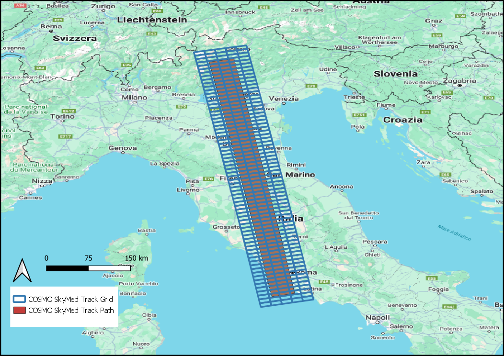

IRIDE Service Segment Lot 2
---
[![Language][]][1]
[![License][]][1]

---
### Naming Convention and Metadata

---

#### Naming Convention - SE-S3-01
**S3_01_SNT_01**

Data delivery will be at burst level. Each burst will generate a product.
Naming convention:
- Track + Orbit Direction - 4 chars (3 + "A"/"D")
- Burst - 4 chars
- Swath - 3 char ("IW"+1)
Example:
ISS Product Name: ISS_S301SNT01_20180101_20220101_015A0250IW2_01.extension

---
**S3_01_SNT_02**

Data delivery will be at burst level. Each burst will generate a product.
Naming convention:
- Track + Orbit Direction - 4 chars (3 + "A"/"D")
- Burst - 4 chars
- Swath - 3 char ("IW"+1)
Example:
ISS Product Name: ISS_S301SNT02_20180101_20220101_015A0250IW2_01.extension

---
**S3_01_SNT_03**

Data will be delivered using a partition of the territory in square tiles, obtained in projection **ETRS89-extended/LAEA Europe (EPSG: 3035**). Each tile will be 100km x 100km wide. The tile's upper left corner coordinates will name the tile. Given the width of the tile, the upper left coordinates will be the points having this form: (XX00000, YY00000), and the relative tile identifier will be EXXNYY. The tiling system, in particular, is the same used in EGMS.
Naming convention:
- Tile identifier - 6 chars (see example below)
- Component: 1 char ("V" or "E")
Example:
ISS Product Name: ISS_S301SNT03_20180101_20220101_E43N19V_01
ISS Product Name: ISS_S301SNT03_20180101_20220101_E43N19E_01

---
**S3_01_SNT_04**

In this case, a single dataset per track will be delivered.
Naming convention:
- Track + Orbit Direction - 4 chars (3 + "A"/"D")
Example:
ISS Product Name: ISS_S301SNT04_20180101_20220101_015A_01

---
**COSMO-SkyMed**

In this case, InSAR data generated per each of the considered CSK frames will be distributed employing a track-specific grid (i.e., once generated, the PS data is cropped using a grid aligned with the satellite track - see figures below). 

A unique ID will identify each grid cell.

NOTE 1: PS/DS products will be cropped using the grid, not the input SAR data. The PS calculation will still be performed at the frame level.

NOTE 2: the case presented below constitutes an example of the grid we will generate and distribute. We will likely define a grid with larger cells.

---

# Metadata
### Sentinel-1

- **ISS_S301SNT01_2018-01-05_2022-12-28_08710208VVA_01.csv** - metadata file example for **S3-01-SNT-01** geospatial products.
- **ISS_S301SNT03_20180105_20221228_100ME43N18V_01.csv** - metadata file example for **S3-01-SNT-03** geospatial thematic products.

---

### CSK Areas Of Interest

| Area of Interest      | ACR   |
|-----------------------|-------|
| Milno_D               | MIL_D |
| Milano_D              | MIL_D |
| Firenze_A             | FIR_A |
| Firenze_D             | FIR_D |
| Venezia_A             | VEN_A |
| Venezia_D             | VEN_D |
| Pisa_A                | PIS_A |
| Pisa_D                | PIS_D |
| Andria_A              | AND_A |
| Andria_D              | AND_D |
| Etna_A                | ETN_A |
| Etna_D                | ETN_D |
| Volterra_A            | VLE_A |
| Volterra_D            | VLE_D |
| Matera_A              | MAT_A |
| Matera_D              | MAT_D |
| Vicenza_A             | VIC_A |
| Vicenza_D             | VIC_D |
| Siena_A               | SIE_A |
| Siena_D               | SIE_D |
| Treviglio_A           | TRV_A |
| Treviglio_D           | TRV_D |
| Ferrara_A             | FER_A |
| Ferrara_D             | FER_A |
| Mottola_A             | MOT_A |
| Mottola_D             | MOT_D |
| Ravenna_A             | RVN_A |
| Ravenna_D             | RVN_D |
| AbbadiaSanSalvatore_A | ASL_A |
| AbbadiaSanSalvatore_D | ASL_D |
| Verona_A              | VER_A |
| Verona_D              | VER_D |
| Torino_A              | TOR_A |
| Torino_D              | TOR_D |
| Aquileia_A            | AQL_A |
| Aquileia_D            | AQL_D |
| Chiavari_A            | CHV_A |
| Chiavari_D            | CHV_D |
| Modena_A              | MOD_A |
| Modena_D              | MOD_D |
| Urbino_A              | URB_A |
| Urbino_D              | URB_D |
| Colletorto_A          | COL_A |
| Colletorto_D          | COL_D |
| Cuneo_A               | CUN_A |
| Cuneo_D               | CUN_D |
| Sardegna              | SRD_A |
| Sardegna              | SRD_D |
| Belluno_A             | BEL_A |
| Belluno_D             | BEL_D |
| Assisi_A              | ASS_A |
| Assisi_D              | ASS_D |
| PiazzaArmerina        | PAA_A |
| PiazzaArmerina        | PAA_D |
| Crotone_A             | CRO_A |
| Crotone_D             | CRO_D |
| Tolmezzo_A            | TOL_A |
| Tolmezzo_D            | TOL_D |
| Noto_A                | NTO_A |
| Noto_D                | NTO_D |
| Bernina_A             | BER_A |
| Bernina_D             | BER_D |
| Celano_A              | CLN_A |
| Celano_D              | CLN_D |
| Genova_A              | GEN_A |
| Genova_D              | GEN_D |
| Bologna_A             | BOL_A |
| Bologna_D             | BOL_D |
| Pistoia_A             | PST_A |
| Pistoia_D             | PST_D |
| NoceraTerinese_A      | NTR_A |
| NoceraTerinesa_D      | NTR_D |
| Brennero_A            | BRN_A |
| Brennero_D            | BRN_D |
| Cortina_A             | CRT_A |
| Cortina_D             | CRT_D |
| Palermo_A             | PAL_A |
| Palermo_D             | PAL_D |
| Norcia_A              | NRI_D |
| Norcia_D              | NRI_D |
| Vulcano_A             | VLA_A |
| Vulcano_D             | VLA_D |
| Mattinata_A           | MTI_A |
| Mattinata_D           | MTI_D |
| ColliAlbani_A         | COA_A |
| ColliAlbani_D         | COA_D |

----
### Setup Python Environment

1. Setup minimal **conda** installation using [Miniconda][]

2. Create Python Virtual Environment

    > -   Creating an environment with commands ([Link][]);
    > -   Creating an environment from an environment.yml file
    >     ([Link][2])  -> **Recommended**;

#### PYTHON DEPENDENCIES:
- [gdal: Python's GDAL binding.][]
- [fiona: Fiona is GDAL’s neat and nimble vector API for Python programmers.][]
- [numpy: The fundamental package for scientific computing with Python.][]
- [pandas: Python Data Analysis Library.][]
- [geopandas: add support for geographic data to pandas objects.][]
- [matplotlib: Library for creating static, animated, and interactive visualizations in Python.][]

[Language]: https://img.shields.io/badge/python-%3E%3D%203.10-blue
[License]: https://img.shields.io/bower/l/MI
[1]: ..%20image::%20https://www.python.org/

[xarray: Labelled multi-dimensional arrays in Python.]:https://docs.xarray.dev
[rasterio: access to geospatial raster data]:https://rasterio.readthedocs.io/en/latest/
[gdal: Python's GDAL binding.]: https://gdal.org/index.html
[tqdm: A Fast, Extensible Progress Bar for Python and CLI.]: https://github.com/tqdm/tqdm
[necdft4: Provides an object-oriented python interface to the netCDF version 4 library.]:https://pypi.org/project/netCDF4/
[fiona: Fiona is GDAL’s neat and nimble vector API for Python programmers.]:https://fiona.readthedocs.io/en/latest/
[numpy: The fundamental package for scientific computing with Python.]:https://numpy.org
[PyTMD: Python package for the analysis of tidal data.]: https://github.com/tsutterley/pyTMD
[pandas: Python Data Analysis Library.]:https://pandas.pydata.org/
[geopandas: add support for geographic data to pandas objects.]:https://geopandas.org/en/stable/
[matplotlib: Library for creating static, animated, and interactive visualizations in Python.]:https://matplotlib.org